## Изучите [README.md](.\README.md) файл и структуру проекта.

# Задание 1
[Диаграмма контейнеров C4 (To-Be)](./diagrams/to-be/containers/CinemaAbyss_Containers.puml)

# Задание 2
### Примечание
Из-за ограничений локального окружения запуск Kafka UI и Postman-тестов затруднён. Реализация выполнена согласно спецификации API.

### 1. Proxy-сервис (Strangler Fig)
Реализован прокси-сервис для бесшовного перехода с монолита на `movies-service` с использованием feature flag.

- Сервис расположен в: `./src/microservices/proxy`
- Все запросы проходят через proxy.
- `/api/movies` направляется в монолит или `movies-service` в зависимости от:
- `GRADUAL_MIGRATION`
- `MOVIES_MIGRATION_PERCENT`
- Остальные эндпоинты всегда проксируются в монолит.

Переход трафика осуществляется постепенно без изменения клиентского A

### 2. Kafka (events-service MVP)
Реализован сервис для демонстрации работы Kafka producer и consumer.

- Сервис расположен в: `./src/microservices/events`
- Реализованы эндпоинты:
- `POST /api/events/movie`
- `POST /api/events/user`
- `POST /api/events/payment`
- При вызове API событие отправляется в Kafka и читается этим же сервисом (consumer) с логированием.

#### Структура
    src/microservices/
                proxy/
                movies/
                events/

# Задание 3. Реализация CI/CD и настройка Proxy в Kubernetes

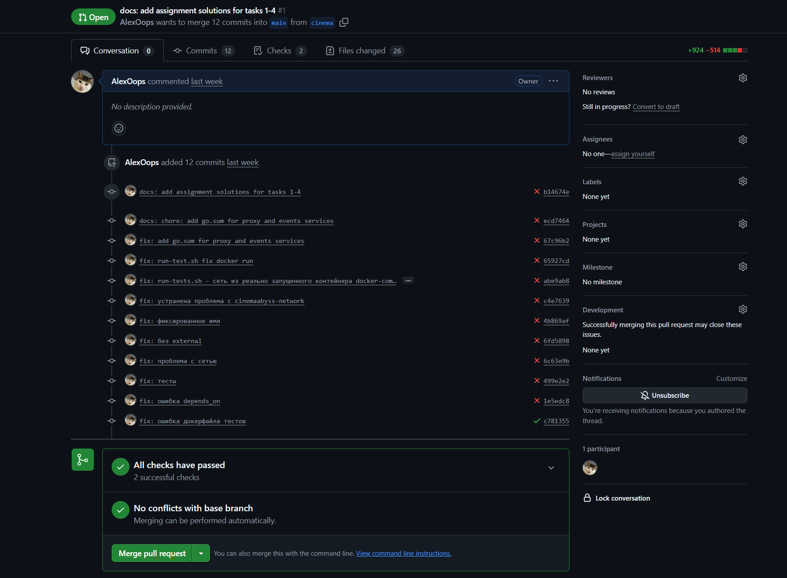

____________

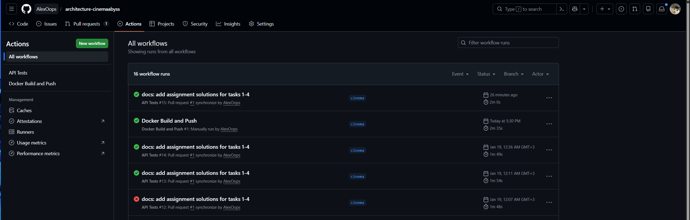

______________

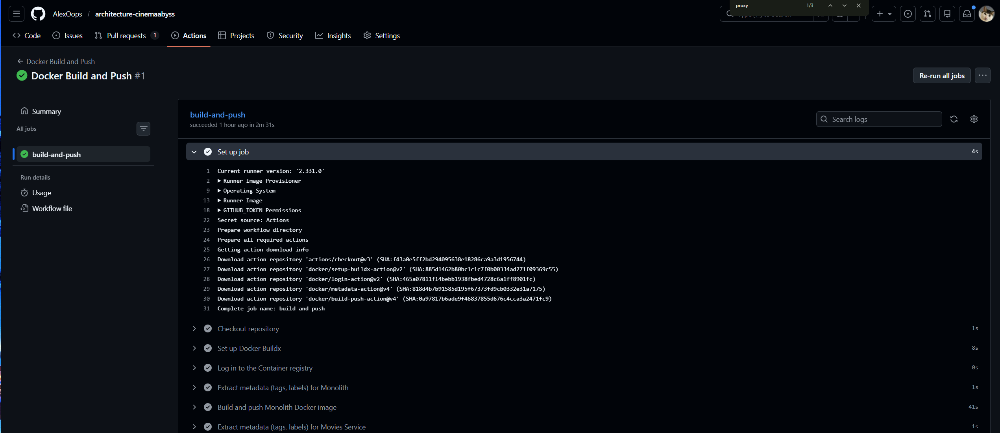

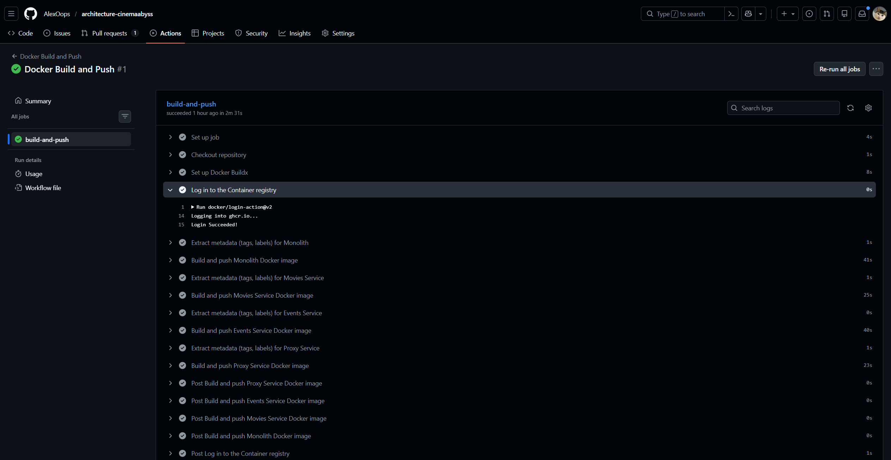

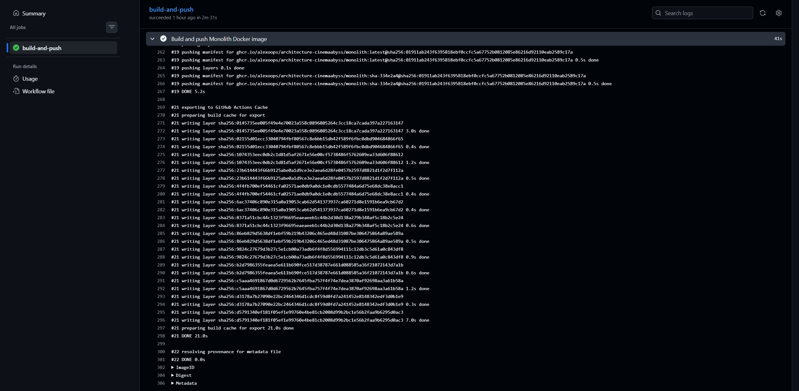

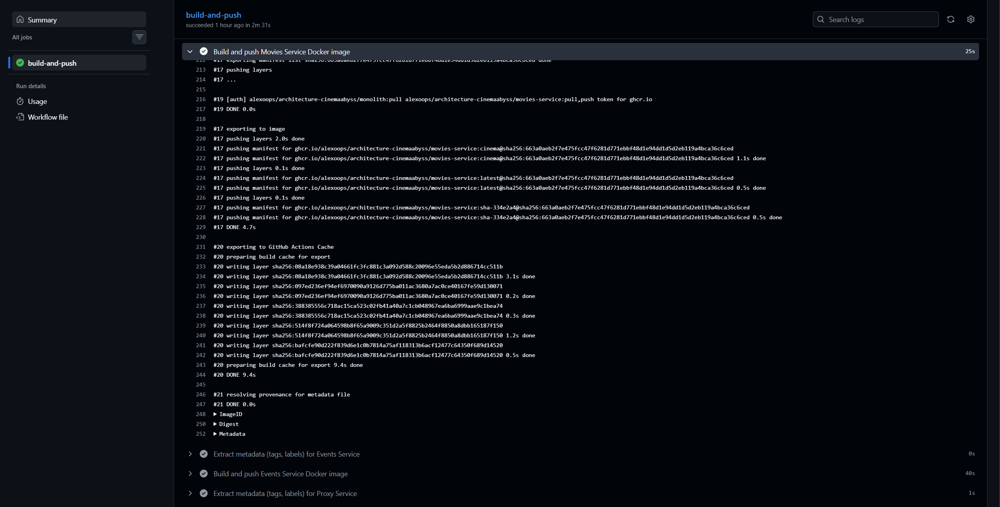

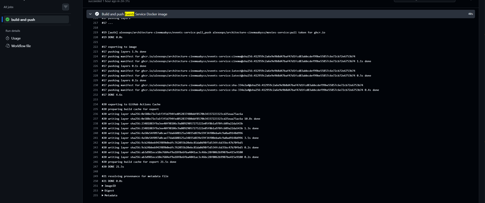

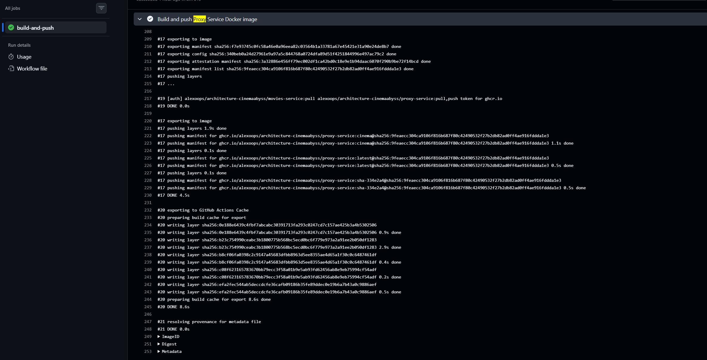

__________
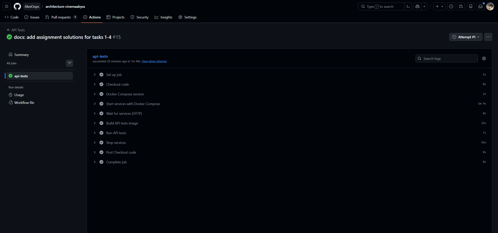

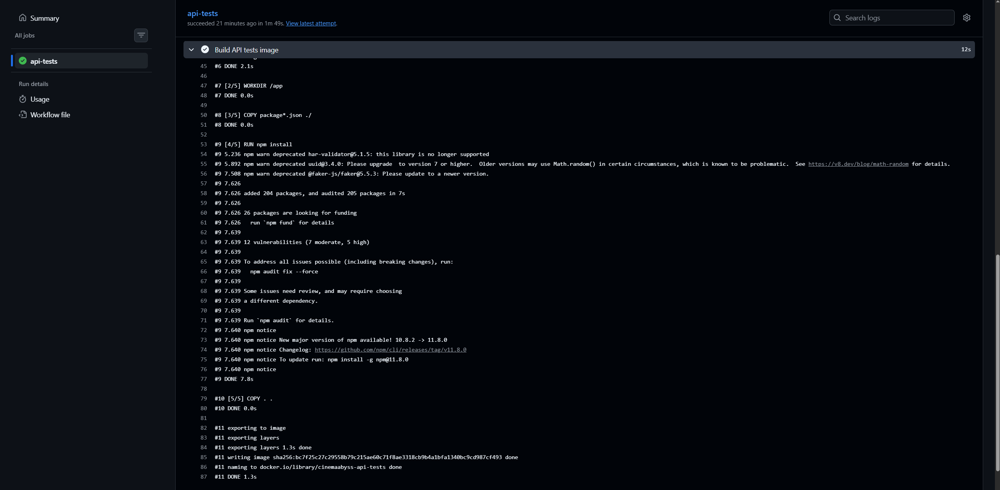

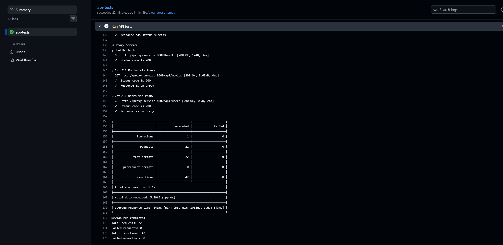

## Часть 1. CI/CD

Доработан workflow `.github/workflows/docker-build-push.yml`:
- добавлена сборка и публикация образов:
  - `proxy-service`
  - `events-service`
- все сервисы собираются и публикуются в GitHub Container Registry:
  - `monolith`
  - `movies-service`
  - `events-service`
  - `proxy-service`

Доработан workflow `.github/workflows/api-tests.yml`:
- запуск сервисов через `docker compose`
- прогон API-тестов через Newman в Docker-контейнере

Обеспечена автоматическая сборка образов и запуск API-тестов при push в репозиторий.

---

## Часть 2. Proxy в Kubernetes

Подготовлены и заполнены манифесты:
- `src/kubernetes/proxy-service.yaml`
  - Deployment
  - Service
- `src/kubernetes/events-service.yaml`
  - Deployment
  - Service

Во всех сервисах:
- используются образы из GHCR:
  - `ghcr.io/alexoops/architecture-cinemaabyss/monolith:latest`
  - `ghcr.io/alexoops/architecture-cinemaabyss/movies-service:latest`
  - `ghcr.io/alexoops/architecture-cinemaabyss/events-service:latest`
  - `ghcr.io/alexoops/architecture-cinemaabyss/proxy-service:latest`
- подключены `imagePullSecrets: dockerconfigjson`
- переменные окружения подключаются через:
  - `cinemaabyss-config`
  - `cinemaabyss-secrets`

### Ingress

Доработан `src/kubernetes/ingress.yaml`:
- `/api/events` → `events-service`
- все остальные запросы → `proxy-service`

Это позволяет проверять создание событий и работу Strangler Fig.

---

### Примечание
Все конфигурационные файлы подготовлены в соответствии с методическими указаниями и готовы к запуску в полноценном Kubernetes-окружении.

---

# Задание 4. Реализация Helm-чартов

Реализовал Helm-чарты для сервисов proxy и events.

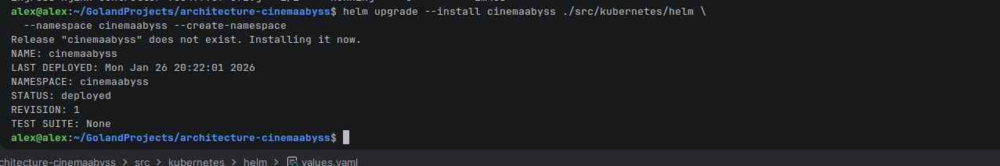

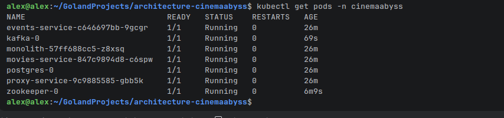

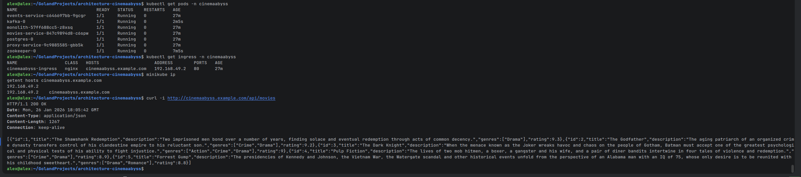

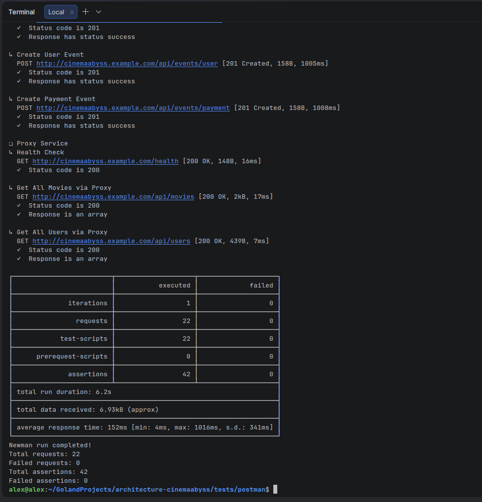

В `values.yaml`:
- заменены образы на собственные из GHCR
- настроен imagePullSecret для доступа к приватным образам
- сконфигурированы параметры сервисов и ingress

В `templates/services`:
- реализованы шаблоны `proxy-service.yaml` (Deployment + Service)
- реализованы шаблоны `events-service.yaml` (Deployment + Service)

В `templates/ingress.yaml`:
- настроена маршрутизация:
  - `/api/events` → `events-service`
  - все остальные запросы → `proxy-service`